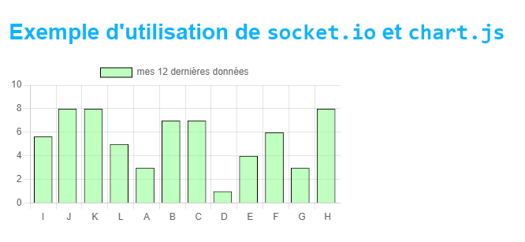

## Description du projet :

Ce dossier contient les fichiers sources pour le TP2 sur socket.io

Il y a du code en commentaire qui contient une version alternative de l'envoi de message depuis le serveur.

En effet, il y a 2 solutions possibles:

- Soit le serveur envoie un nombre différent à chaque client connecté (Cela multiplie le nombre de processus d'envoi)

Pour cela, nous stockons dans une map les ID de tous les interval mis en place pour chaque client. Lorsqu'un client se déconnecte, on utilise clearInterval et on supprime le le client et son interval de la map.

- Soit le serveur envoie le même nombre à tous les clients connectés.

Dans ce cas là, on utilise juste this.#io.emit(...) pour envoyer le même message à tous les clients. Ainsi, il n'y pas de changements à gérer lors de la connexion/déconnexion d'un client.

## Lancer le projet :

> npm install && npm run start

## Résultat final :

